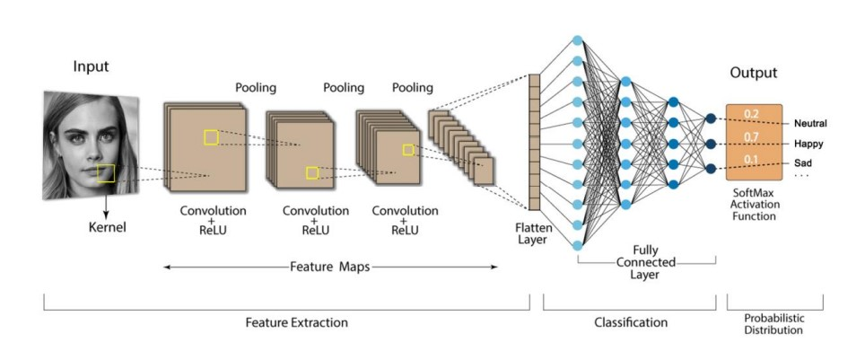
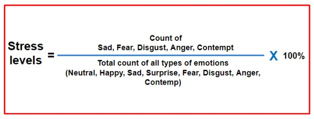

# About the project

The good mental health of the employees in an organization greatly affects the development 
and efficiency of the organization. Usually, when an employee is under stress in an 
organization it is first noticed only by some of the people closest to him. Perhaps the 
management of the company was not aware of such a thing at all. But, Nowadays, many 
companies are turning to the use of computers to carry out their daily activities. So employees 
spend most of their time in front of a computer. Taking advantage of this, I decided to create 
an application to make predictions about a person's stress using Artificial Intelligence, just as 
the human brain does. This AI agent seeks to apply Machine Learning and Image Processing 
techniques to autonomous human facial emotion detection. The application is capable of 
recognizing 7 facial expressions (***Neutral, Happy, Sad, Surprise, Fear, Disgust, Anger***). Accordingly, it predicts what mental state an employee was in most of the day.

# User types

This system is designed based on two groups of users. One of these user groups is **employees**. 
The other group is the **managers** of the organization. The way the system behaves varies 
according to those user groups. The system monitors only general employees of the 
organization. Only managers have the ability to view reports with values calculated based on 
employee observation data. Therefore, the system identifies the category of users and access 
privileges by category.

# Why this type of system is important to an organization?

Establishing such a system in an organization allows early detection of the mental health status 
of employees, enabling managers to use their employees more effectively to achieve the 
business objectives of the organization. Employees also always work under minimal stress 
without being overburdened so that the organization can get the maximum level of contribution 
from them as well.

# What are the functions in this system?
<ul type="disk">
 <li>Recognize user types.</li>
<li>Authenticating users. (only loging dashboard).</li>
<li>Display percentages of emotions and stress levels in the dashboard.</li>
<li> Store predicted stress levels.</li>
<li>Filter dashboard by required employee.</li>
<li>Human detection AI.</li>
<li>Human facial emotion recognize AI.</li>
</ul>

# AI model

### Human detection AI

This is make by using python libray that call 
**MTCNN - Multi-Task Cascaded Convolutional Neural Networks.**
  https://pypi.org/project/mtcnn/

### Human facial emotion recognize AI.

I have chosen data set from <a href='https://www.kaggle.com/'>Kaggle </a> 
to train this model,
<ul>
<li><a href='https://www.kaggle.com/datasets/msambare/fer2013'>FER-2013</a></li>
</ul>

CNN is trained with the 
training set and checking the accuracy of the model. By the nature of the deep neural networks, it is 
almost not possible to create perfect architecture by the first attempt. So it is necessary to create and try 
hand full of architecture to find a good one. Out of these, the model with the highest accuracy and the 
lowest loss value is selected and the model is re-run with testing data to take again their loss value and 
accuracy value to investigate the model performance on unseen data before. This selected model is 
tuned to achieve a more suitable model until the values obtained during testing are narrowed down to 
more acceptable values.

# Predicting stress levels.

There are five types of emotions that can use us to predict stress levels. They are Sad, Fear, 
Disgust, Anger and contempt. According to the data stored concerning this, we need to find a total of 
the recognized five kinds of emotions. That sum is calculated as a percentage of the sum of all identified 
emotions. That percentage is taken as the level of stress at that time.

